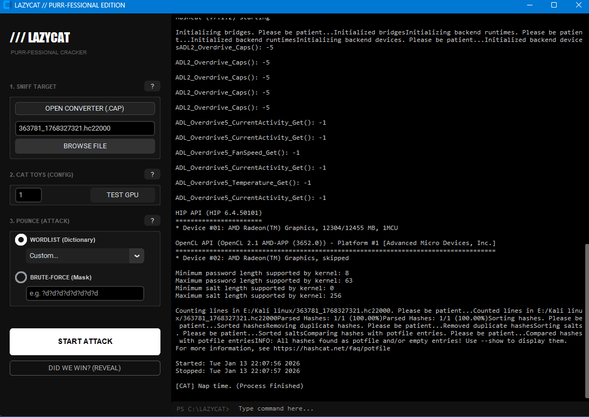

# 🐱 LazyCat Cracker // Purr-fessional Edition

**LazyCat** is a modern, dark-themed GUI wrapper for **Hashcat**, designed specifically for cracking WPA/WPA2 Wi-Fi Handshakes (`.hc22000`). It turns complex command-line attacks into a simple "Point & Click" experience.

## ✨ Features

 * **Stealth UI:** Deep black/gray theme with integrated read-only terminal logs.
 * **Plug & Play:** Hashcat engine is **pre-compiled** and included—no setup required.
 * **Auto-Detection:** Automatically identifies your GPU IDs and Hashcat engine path.
 * **Safe Execution:** Runs commands in a dedicated thread to prevent UI freezing.

    <p align="left ">      
                    
    </p>

## 📦 Downloads & Installation

### 1. The App (Required)

Download **`LZC-Stand-alone.7z`**.

* **Pre-bundled:** This contains both `LazyCat.exe` and the **Hashcat Engine**.
* **How to use:** Just extract and run.

### 2. The Wordlists (Optional)

Download **`LZC-Wordlists.7z`**.

* Contains `rockyou.txt` and other top-tier dictionaries. Place this folder next to the `.exe`

---

## 🛠️ Recovery & Troubleshooting

**Note:** LazyCat comes with Hashcat ready to go. However, if your antivirus deletes the engine or you encounter a "File Not Found" error:

1. **Manual Download:** Go to the [Official Hashcat Website](https://hashcat.net/hashcat/) and download the latest binaries.
2. **Fix:** Extract the download and move the files into a folder named `hashcat` inside your LazyCat directory.
3. **Structure Check:**
```text
/LazyCat_Folder/
  ├── LazyCat.exe
  └── wordlists/         <-- (From Wordlists package) 
       ├── rockyou.txt
       └── ...
```


---

## 📜 Credits

This tool is a GUI wrapper. The heavy lifting is done by the world's fastest cracker:

* **Engine:** [Hashcat](https://hashcat.net/) — Special thanks to Jens "atom" Steube and the Hashcat team for their incredible work.

---

## ⚠️ Disclaimer

> This tool is for **educational purposes** and **authorized security testing** only. The usage of this tool for attacking targets without prior mutual consent is illegal. The developer assumes no liability and is not responsible for any misuse or damage caused by this program.

